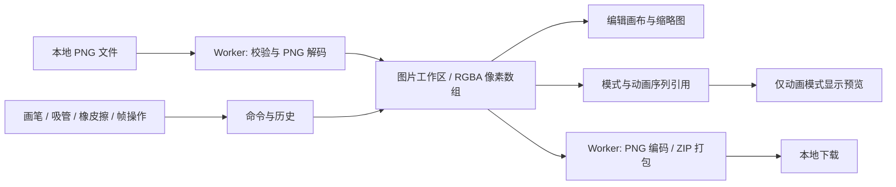

# 点修 · 架构设计

版本：0.4 · 日期：2026-10-08 · 状态：首期已实现，PNG/ZIP Worker 集成已验证

## 1. 架构决策

采用 Next.js 网站框架 + 客户端编辑核心 + Canvas 2D + Web Worker。首期无需业务后端、数据库或账号体系，图片在用户设备内解码、编辑与导出。网站框架为后续官网、教程、账号和云项目提供组织结构。

使用 Next.js App Router + React + TypeScript 构建网站与界面，Canvas 2D 显示画布，Web Worker 承担 PNG 编解码和 ZIP 打包。库版本与具体 PNG/ZIP 实现待开发时验证并锁定，不在此文档中预设版本。

关键决定：**RGBA 数组是像素数据的唯一事实来源，Canvas 只负责显示。** Canvas 的透明度预乘与浏览器色彩转换可能改变往返像素，因此不使用 Canvas 解码或 `toBlob()` 作为严格像素保真的主流程。

PNG 编解码器必须支持 RGBA、RGB、灰度、索引色及其透明信息向 8 位 RGBA 的无损展开；不应用色彩配置转换。对于不支持的格式明确拒绝。编解码器选型必须通过透明像素、半透明像素及索引色测试后才能确定。

### 网站与客户端边界

- `/`：产品首页，首期静态预渲染；提供说明和编辑器入口。
- `/editor`：页面外壳可预渲染，编辑核心通过客户端边界加载。
- 教程页面：后续静态预渲染，不要求每次请求 SSR。
- 账号与云项目：后续按权限和数据需求接入服务端；首期不实现。

编辑器入口声明 `use client`；Canvas、Worker、文件读取和 Blob 下载在挂载后或用户事件中创建，不在模块顶层或服务端渲染期间访问浏览器对象。若依赖在导入时访问浏览器对象，在客户端包装组件内使用关闭 SSR 的动态导入。`use client` 本身并不意味着初始 HTML 完全不会被预渲染。

像素数组、历史和文件对象留在浏览器，不通过 Server Components 的 props 或 Server Actions 传递。Worker 在客户端创建，卸载时终止并释放资源。构建阶段验证 Worker 模块路径及打包产物。

参考：[Next.js 服务端与客户端组件](https://nextjs.org/docs/app/getting-started/server-and-client-components)。

## 2. 模块与数据流



| 模块 | 责任 |
| --- | --- |
| ProjectStore | 独立图片尺寸和数据、模式、动画成员顺序、选中对象、修订号；提交原子操作 |
| PixelEngine | 坐标映射、像素读写、拖动路径插值、脏区域计算 |
| CommandHistory | 可逆命令、事务提交、撤销重做、历史内存预算 |
| CanvasRenderer | 像素图、棋盘背景、网格、缩放和平移；不改变源像素 |
| AssetPanel / FramePanel | 图片列表与帧列表，复用缩略图；按模式显示不同操作 |
| AnimationPlayer | 仅动画模式且至少两帧时启用；独立游标、时钟与资源释放 |
| ImportExportService | 文件校验、Worker 通信、批次提交与下载 |
| CodecWorker | PNG 编解码、ZIP、进度及错误报告 |

UI 使用 React 状态管理控制信息；大像素数组保存在独立 store 中，通过修订号订阅变化，避免每个像素修改都触发整个界面重建。

## 3. 核心数据模型

以下是设计示意，并非已实现代码。

```typescript
type ImageId = string;

interface PixelImage {
  id: ImageId;
  name: string;
  width: number;
  height: number;
  pixels: Uint8ClampedArray; // width * height * 4
  revision: number;
}

interface AnimationSequence {
  width: number;
  height: number;
  frameIds: ImageId[]; // 引用 images，顺序决定播放和导出
  activeFrameId: ImageId;
  fps: number;
}

interface Project {
  id: string;
  mode: 'images' | 'animation';
  images: PixelImage[]; // 独立尺寸；所有像素只保存一份
  activeImageId: ImageId | null;
  animation: AnimationSequence | null; // 首期最多一个序列
  revision: number;
}

interface ViewState {
  zoom: number;
  panX: number;
  panY: number;
  gridVisible: boolean;
  tool: 'pencil' | 'picker' | 'eraser' | 'pan';
  color: [number, number, number, number];
}
```

视图与项目数据分离。切换工具或缩放不创建编辑历史；帧率作为预览设置，不参与首期像素编辑历史。项目修改和导出使用修订号，避免异步导出完成后错误清除新的修改提示。当前图片/帧导出仅标记对应图片修订。动画导出只覆盖参与的图片和序列修订，未参与图片仍保留未导出提示；图片 ZIP 导出不代表动画顺序已持久化。PNG/ZIP 不含 FPS 等项目设置，需明确展示本地临时状态，后续项目文件负责完整保存。

ViewState 按 ImageId 保存；图片切换不重置视图。初始空项目 images=[]、animation=null；首批图片不定义全局尺寸。序列引用要求 ID 存在且尺寸一致。未导入时进入动画模式允许 animation=null 的空状态；首次导入帧建立序列尺寸。

## 4. 编辑与渲染

鼠标位置先转换为画布内 CSS 坐标，再减平移并除缩放，使用向下取整得到像素坐标；设备像素比仅影响 Canvas 后备缓冲，不重复应用到指针坐标。越界位置不写入。

底层图像用整数像素绘制，并关闭 `imageSmoothingEnabled`。网格作为覆盖层在放大到足够辨认时显示；棋盘格在图像下方显示，均不进入 RGBA 数据。

拖动采用 Pointer Events 与 pointer capture，使用整数线段算法连接连续采样点。每个 pointer down 到 pointer up 是一个事务，重复经过同一像素只保留首次旧值和最终新值。收到 pointer cancel 或失焦时结束并提交已绘制部分，释放指针状态。

每次编辑递增帧修订号，仅使对应帧的缩略图及渲染缓存失效。首期优先保证正确性，脏矩形局部刷新在性能证据支持时加入。

### 渲染边界与性能策略

PixelEngine 和 CommandHistory 不依赖 Canvas API。渲染器提供设置帧、更新区域、设置视图和销毁资源等接口；首期实现 Canvas2DRenderer，后续可替换 WebGLRenderer。

不为每个像素创建 React 节点或独立场景对象。以图像缓冲绘制，按变化调度刷新；图像与网格、光标分层，鼠标移动无需重新生成像素数据。只有变化帧才更新缩略图；限制帧缓存总量。

先测 256×256 多帧、1024×1024 单帧及总像素预算附近项目，再决定局部刷新或更换渲染器。只有 Canvas 2D 优化后仍无法满足交互目标，或引入大量图层、滤镜混合时，才评估 WebGL；不以帧数量单独作为切换依据。

## 5. 撤销与帧操作

绘制命令保存 imageId、像素索引列表、修改前后 RGBA；不为单点操作复制整帧。删除图片命令保留数据、原位置及相关动画引用；删除帧命令只保留序列引用和原位置。排序记录前后 ID 顺序；复制图片或帧必须深拷贝像素数组。

采用项目级单一历史栈，覆盖两种模式及所有图片。模式转换是可逆命令，记录前后模式、序列引用及选中对象，不复制源像素。命令必须恢复有效的选中帧；修改已删除帧前，历史会先恢复该帧。无实际变化的笔画不创建记录。

历史预算计算包括像素差分和被历史引用的帧缓冲。帧管理也采用事务，在状态校验完成后整体提交。

## 6. 动画时钟

使用 `requestAnimationFrame` 与单调时钟；按经过时间计算播放索引，不将每次回调等同于一帧。低负载时显示全部帧，负载较高时跳过显示以维持时间进度。后台页面暂停，回前台重新建立时间基准。

播放游标与选中帧分离；修改可在下一次渲染反映到预览。插入、删除、排序时重新建立播放时钟，避免引用无效帧。只有至少两帧且在动画模式中才能播放。单帧显示添加提示并禁用播放；离开动画模式取消调度，返回默认暂停。

## 7. 导入导出与 Worker

导入前捕获模式与序列版本。图片模式不要求尺寸相同；动画模式校验公共尺寸。模式切换或序列变化时丢弃不再匹配目标的结果，提示重试。

导入：检查文件大小 → 解析 PNG 签名和头部 → 检查尺寸、位深、动画标记与总像素预算 → Worker 解码整个批次 → 主线程再次检查项目状态 → 一次性追加。批次中任意文件失败就丢弃该批次结果。

异步任务携带 taskId 与项目修订；解码期间用户新建项目或取消任务时丢弃过期结果。防止两个批次完成顺序改变帧顺序，首期串行执行导入任务。

导出：捕获当前项目顺序和像素快照 → Worker 直接编码 RGBA 为 PNG → 图片模式按规范化文件名打包并消除重名；动画模式按帧编号打包 → 创建 Blob URL 下载 → 释放 URL。向 Worker 转移的是副本，避免转移底层缓冲后编辑数据失效。导出期间继续编辑不会改变已捕获的快照。

避免同时保存所有帧的多个副本；批量编码逐帧处理，并控制打包缓存。预算需覆盖源数据、历史、渲染缓存、快照与编码临时数据，而不只计算源像素数组。

## 8. 部署、安全与错误处理

首期路由均可静态导出时，使用 Next.js 静态导出并部署到 HTTPS 静态托管；发布前验证路由、资源路径与 Worker 加载。后续使用动态服务端能力时切换到支持 Next.js 运行时的部署方式，具体供应商在发布阶段确定。静态导出不支持依赖请求运行的服务端功能。参考：[Next.js 静态导出](https://nextjs.org/docs/app/guides/static-exports)。Worker 与资源同源，无远程图片导入，避免跨域画布与外部内容依赖。首期不添加图片分析埋点。

解码前检查尺寸与预算，处理损坏文件和异常分配；文件名只用于文本展示和经过规范化的下载路径。Worker 崩溃、内存不足、编码失败均反馈可理解的错误，保留现有项目。

本地处理不是持久化：刷新会丢失项目。首期提供修改提示；项目文件及自动恢复属于后续范围。

## 9. 建议目录

```text
src/
  app/
    layout.tsx     网站公共布局
    page.tsx       产品首页
    editor/
      page.tsx     编辑器页面外壳
  features/editor/ 客户端入口与编辑器组织
  components/      工具栏、颜色面板、帧面板、预览
  core/            像素引擎、项目模型、命令历史
  rendering/       Canvas 渲染与缓存
  services/        文件导入、导出、Worker 客户端
  workers/         PNG 与 ZIP 处理
  tests/           像素保真样本与核心测试
```

## 10. 开源复用策略

不要求全部从零开发。优先复用 PNG、ZIP 和通用 UI 基础库；像素引擎、帧状态和历史由产品掌控。Dotting 2.1.18 已完成最小场景验证：基础交互可用，但大图同步开销与历史控制不符合默认方案，因此已确认采用自研精简 Canvas 2D 核心，复用 PNG/ZIP 基础库。

具体候选、验证门槛与来源见 [开源复用评估](04-open-source-evaluation.md)。Dotting 的验证依据见 [验证报告](05-dotting-validation.md)；PNG/ZIP 已采用 fast-png 6.4.0 与 fflate 0.8.3，并补充 CRC、解压长度及低位深 Adam7 处理；结果见 [开发验收记录](06-development-validation.md)。

## 11. 模式转换与数据一致性

“作为动画帧编辑”先校验选中图片（未选择时为全部）的尺寸和有效性，按当前列表顺序建立引用，原子提交序列与模式。未参与图片不删除；源数组共享引用而非复制。已有动画时仅允许显式追加未参与图片，不隐式替换现有序列。

单纯切换模式保留数据与历史，使用模式命令恢复选中对象和布局。新增独立图片不加入序列；动画导入则同时新增图片和帧引用。删除源图片同步移除引用，不允许将非空动画删成零帧；空项目新建与导入流程单独处理。

Canvas 按当前选中 PixelImage 尺寸渲染；模式不改变像素引擎。预览读取序列公共尺寸，普通图片模式不挂载播放器。批次导入、转换、删除和撤销后统一检查引用和尺寸不变量。
